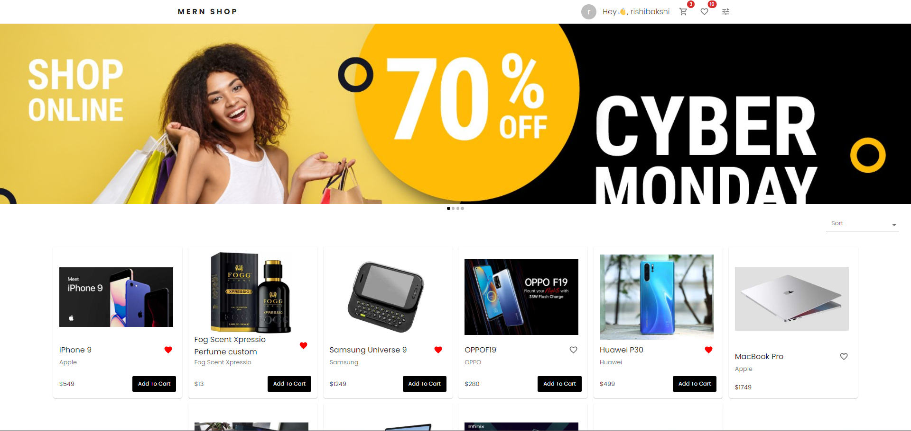
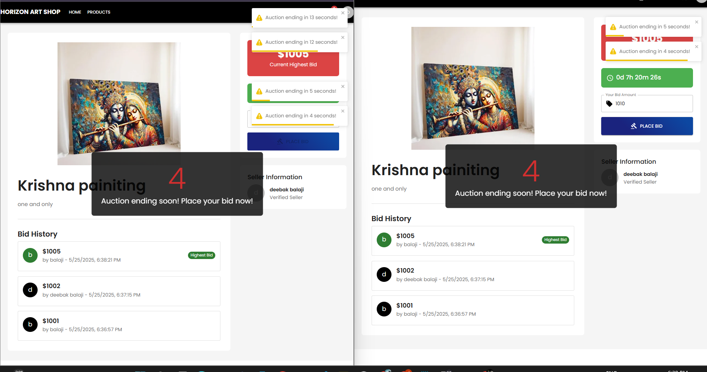

# 🛍️ MERN E-Commerce Platform

A full-featured e-commerce platform built with the MERN stack (MongoDB, Express.js, React.js, Node.js) featuring a unique auction system for special products.

## 🌟 Key Features

### 🎯 Highlight: Live Auction System
- Real-time bidding functionality
- Countdown timers for auction items
- Automatic winner selection
- Bid history tracking
- Email notifications for auction updates
- Secure payment processing for winning bids

### 🛒 Core E-Commerce Features
- User authentication with OTP verification
- Product management with categories and brands
- Shopping cart and wishlist functionality
- Secure payment processing with Razorpay
- Order tracking and history
- User profile management
- Address management for shipping

### 👨‍💼 Admin Dashboard
- Product management
- Order management
- User management
- Analytics and reporting
- Auction management

### 📱 Mobile Responsive
- Responsive design for all devices
- Mobile app support (iOS & Android)
- QR code for quick app download

## 🚀 Tech Stack

### Frontend
- React.js
- Material-UI
- Redux Toolkit
- Framer Motion
- Axios

### Backend
- Node.js
- Express.js
- MongoDB
- JWT Authentication
- Razorpay Integration

## 📸 Website Screenshots

### Homepage


### Admin Dashboard


### Auction System




## 🛠️ Installation

1. Clone the repository
```bash
git clone https://github.com/yourusername/mern-ecommerce.git
cd mern-ecommerce
```

2. Install dependencies
```bash
# Install backend dependencies
cd backend
npm install

# Install frontend dependencies
cd ../frontend
npm install
```

3. Environment Setup
```bash
# Backend (.env)
MONGODB_URI=your_mongodb_uri
JWT_SECRET=your_jwt_secret
RAZORPAY_KEY_ID=your_razorpay_key
RAZORPAY_KEY_SECRET=your_razorpay_secret

# Frontend (.env)
REACT_APP_API_URL=your_backend_url
```

4. Run the application
```bash
# Run backend
cd backend
npm run dev

# Run frontend
cd frontend
npm start
```

## 📋 Project Structure

```
mern-ecommerce/
├── frontend/
│   ├── src/
│   │   ├── features/
│   │   │   ├── auction/      # Auction system
│   │   │   ├── auth/         # Authentication
│   │   │   ├── cart/         # Shopping cart
│   │   │   ├── checkout/     # Checkout process
│   │   │   ├── products/     # Product management
│   │   │   └── ...
│   │   └── ...
│   └── ...
└── backend/
    ├── controllers/
    ├── models/
    ├── routes/
    └── ...
```

## 🔐 Security Features
- JWT Authentication
- OTP Verification
- Secure Payment Processing
- Data Encryption
- Input Validation

## 📱 Mobile App Features
- Push Notifications
- Offline Support
- Biometric Authentication
- Camera Integration for QR Codes

## Data seeding
- **Get started quickly with pre-populated data**: Populate your database with sample users, products, reviews, and carts, enabling you to test functionalities without manual data entry.

**Steps**:
- Open a new terminal window.
- Navigate to the `backend` directory: `cd backend`
- Run the seeding script: `npm run seed` ( This script executes the `seed.js` file within the `seed` subdirectory equivalent to running `node seed/seed.js` )

### Database Backup
- **Restore from backup**: The project includes a database backup in the `dump` folder that you can use to restore the complete database.

**Steps to restore from backup**:
1. Make sure MongoDB is installed and running
2. Navigate to the project root directory
3. Run the following command to restore the database:
```bash
mongorestore dump/
```

This will restore all collections with their data from the backup. The backup includes all necessary collections like users, products, orders, etc.

## 📄 License
This project is licensed under the MIT License - see the [LICENSE](LICENSE) file for details

## 👨‍💻 Developer
Developed with ❤️ by **Deebak Balaji Manohar**

## 📞 Support
For support, email deebakbalaji18@gmail.com.

---
Made with ❤️ by Deebak Balaji Manohar 